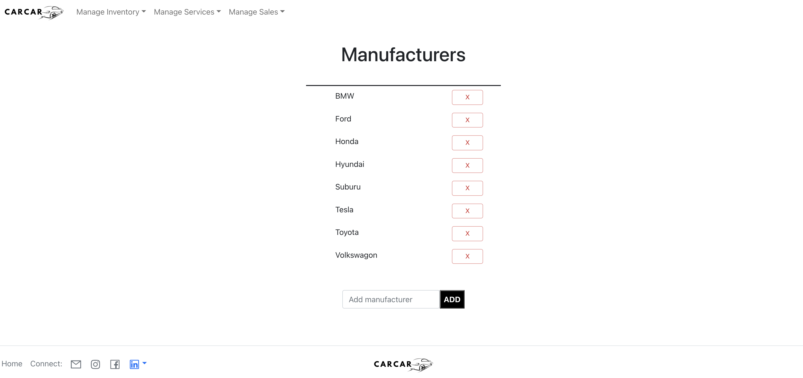
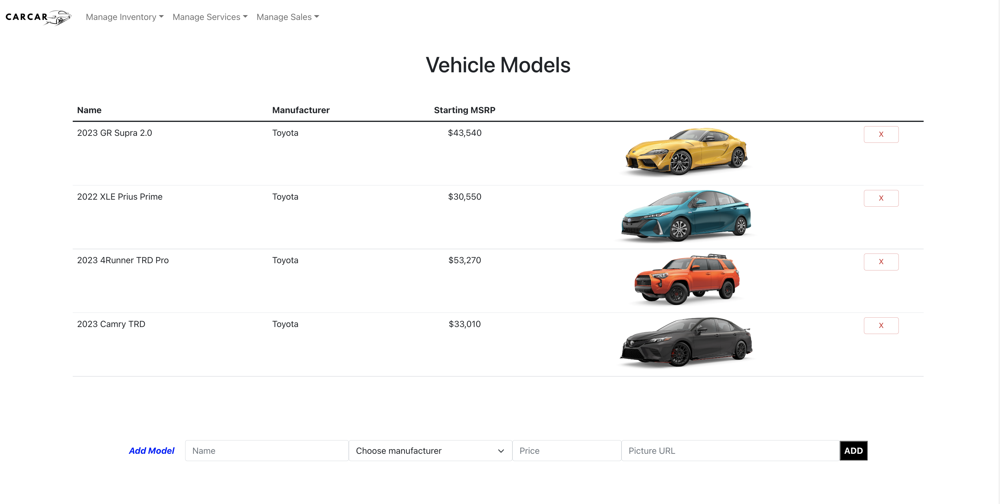
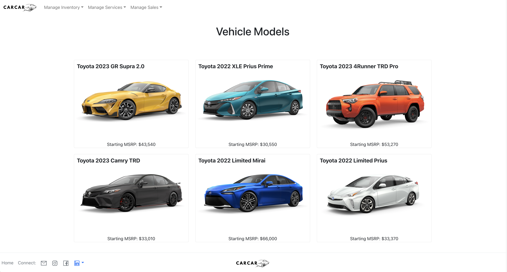
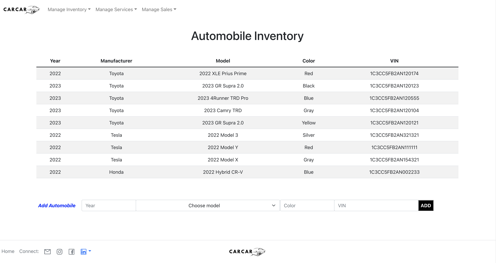
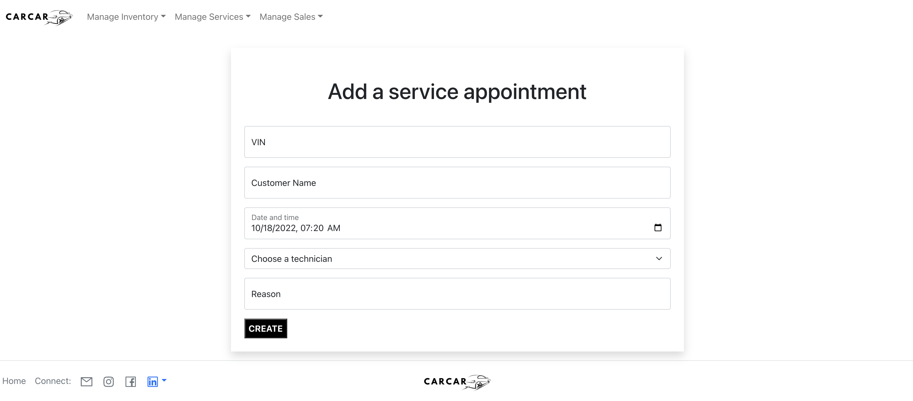
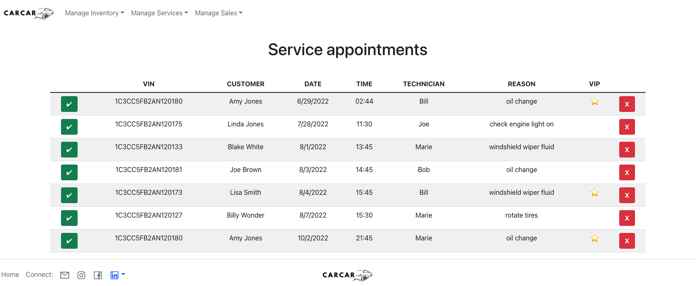
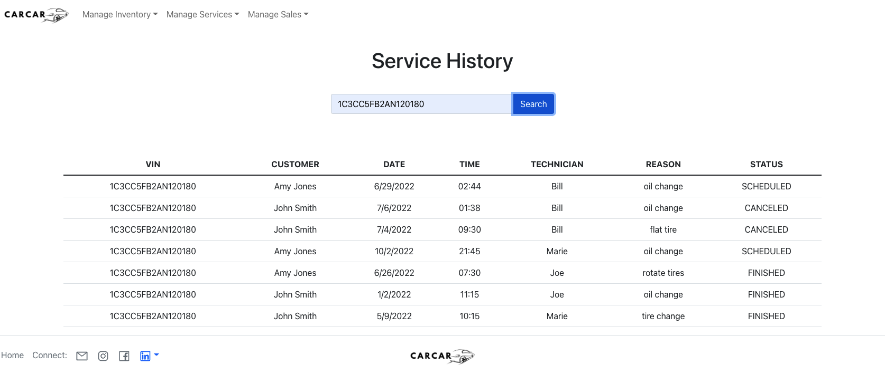
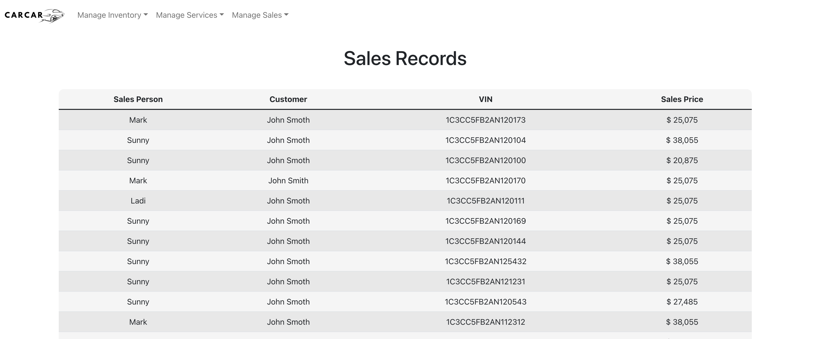
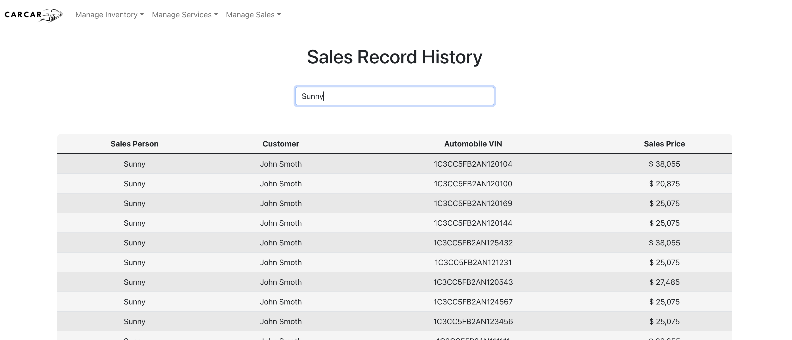

# CarCar

## Intended market

The expected intended market is car dealerships looking for a program to assist in managing automobile inventory, service appointments, and sales.

## Functionality

* Users can add or remove manufacturer names, vehicle models, and specific automobiles to the database to track inventory
* Users can view lists of manufacturers, vehicle models, and automobiles in the inventory
* Users can add service appointments to the database, see the list of all upcoming appointments, and the history of all appointments (scheduled, canceled, and upcoming) based on a specific VIN number
* Users can add sales records and track sales history

# Design
## Home page

This is the home page that users will see when they get to the website. The user can click on any item within the navigation bar, each of which has multiple dropdown items.

## Manufacturers

This is where employees can add or remove manufacturers that are currently or have been in inventory.

## Vehicle Models

This is where employees can add or remove vehicle models that are currently or have been in inventory.

This is the customer view of the vehicle models. My stretch goal in the future is to add a customer signup and login page so customers will have the ability to favorite/save vehicle models that they like/are thinking of purchasing.

## Automobile Inventory
This is where employees can input automobiles that are currently in inventory. When the automobile is sold by a sales person, the automobile no longer appears in the inventory.

## Add Appointment

This is the page where a service appointment can be created and added to the database.

## List of all Upcoming Service Appointments

This is the page where all upcoming service appointments are listed (sorted in chronological order). The technician can mark an appointment complete or can cancel an appointment, which will remove that appointment from the list. The status of each appointment (scheduled, completed, and caneled) are tracked.

## Search Service History

On this page, an employee can search for all service history related to a specific VIN. The table rows are color-coded based on the status of the appointment (canceled=red, scheduled=yellow, completed=green).

## Sales Records

On this page, all sales records are listed.

## Filtered Sales Records

On this page, a name of a salesperson can be inputted and a list of all of that salesperson's sales records are listed.

# More About Design
In general, in Domain-driven design, microservices are typically their own bounded contexts it seems, which is why they're able to be split up into microservices in the first place. "Sales," "Services," and "Inventory" are each their own separate microservices, meaning that they are able to function on their own in some capacity, meaning they could possibly each be their own bounded context. However, "Sales" is directly dependent on "Inventory" because one can't sell cars without knowing what cars are in the inventory to sell, so putting them together in one bounded context makes sense. "Services," on the other hand, is not directly dependent on "Inventory" in order to fully function, so it can be in it's own bounded context.

Within the bounded context of "Sales" and "Inventory," the aggregate root would be automobiles since it's the common thread between the two microservices and it's what everything within "Inventory" and "Sales" is dependent on. One can't have an inventory without an automobile and an automobile sales person can't sell anything without having automobiles in stock to sell. In this case, automobiles are an entity because they have properties that can be changed and technically have a "life cycle" since they transition from being in inventory to being sold. Descriptors of the automobile that are included within this bounded context include the manufacturer, vehicle model, VIN number, etc., each of which are value objects since they're immutable once created.

With the bounded context of "Services," automobiles are considered value objects since we are not modifying them in any way and only care about their VIN to check on whether they came from the company's inventory. Appointments are entities since their status, time, date, etc. can be changed. Status is also an entity since it can be changed. Additionally, technicians are entities because they also change over time. In "Services," the aggregate root would also be automobiles, since appointments being scheduled and technicians working are both dependent on the presence of automobiles and their owners scheduling appointments for service. The aggregates would be appointments and technicians.

## Service microservice
The models that are necessary for "Services" include Technician, Appointment, AutomobileVO, and a Status model (to handle the status of appointments -- scheduled, canceled, and finished). Appointment has two ForeignKeys, one to Status and the other to Technicians, each of which demonstrating a one-to-many relationship with Appointment. I wrote two functions within the Appointment model in order to define when an appointment is considered finished vs canceled, with the default status when an appointment is created being "scheduled." 

The AutomobileVO model represents the Automobile model from "Inventory," but is labeled as a value object since within "Services," this class is considered immutable (since we can't change the VIN of an automobile that already exists). AutomobileVO will poll data from "Inventory" via "poller.py". The data that we need from the inventory microservice is the VIN number so that we can compare VIN numbers in "Inventory" to VIN numbers in the Appointment model within "Services" to determine if a customer is a "VIP".

## Sales microservice
The models usesd for the Sales microservice are AutomobileVO, SalesPerson, Customer, and SalesRecord. All of my models are relatively simple other than SalesRecord which has three foreign keys, one for each of the other models. AutomobileVO has a one to one relationship with SalesRecord. Customer has a one to many relationship with SalesRecord. SalesPerson has a one to many relationship with SalesRecord. 

The AutomobileVO represents the Automobile model from the Inventory microservice, and it is a value object which means it's immutable. We pull the automobiles from inventory using our poller.