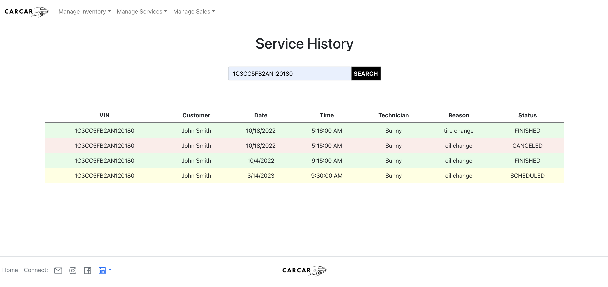
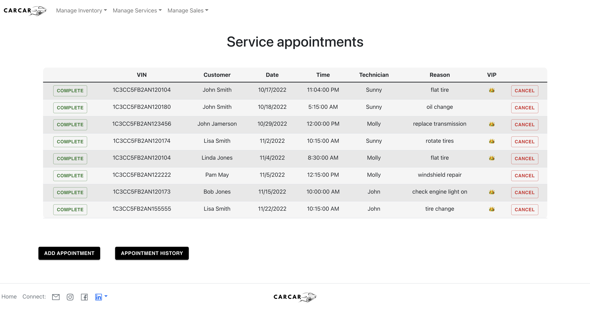

## Home page

This is the home page that users will see when they get to the website. The user can click on any item within the navigation bar, each of which has multiple dropdown items.

## Add Appointment

This is the page where a service appointment can be created and added to the database.

## Search Service History

On this page, an employee can search for all service history related to a specific VIN.

## List of all Upcoming Service Appointments

This is the page where all upcoming service appointments are listed. The technician can mark an appointment complete or can cancel an appointment, which will remove that appointment from the list.

## Add Automobile

This is where an employee can add an automobile to the inventory database.

